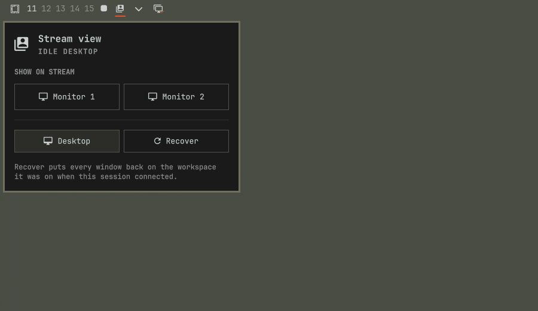

# Stream View

Choose which physical monitor your Moonlight client is looking at, from the
client itself.

Sunshine captures one output. If you stream a headless output you get a clean
remote desktop, but none of the work already open on your real screens. If you
capture a physical monitor instead you get a mirror, letterboxed to whatever
aspect ratio your client happens to be.

Stream View gives you a third option. Click **Monitor 1** and that screen's
current workspace moves onto the stream, windows and layout intact, re-tiled to
your client's resolution. Click **Monitor 2** to swap to the other screen.
Click **Desktop** to hand it back. Disconnect and everything returns to where
it was, on its own.

Because the Omarchy bar is drawn on every output, including the headless one
Sunshine captures, the widget and its panel are visible and clickable from the
remote client. No keyboard gymnastics, no reaching for the host machine.



## Why it moves workspaces, not windows

Moving a whole workspace is one compositor dispatch that keeps the layout
intact, and the windows re-flow to the client's resolution — so a 16:9 laptop
gets a real 16:9 arrangement of a 21:9 monitor's apps rather than a letterboxed
picture of one.

It is also the safer choice. Windows never leave their workspace, so there is no
per-window bookkeeping to go stale, and putting things back is always well
defined. The move survives a `hyprctl reload`, which matters because monitor
hotplug daemons reload the config; a borrowed workspace will not be yanked back
mid-stream. Runtime workspace rules do *not* survive a reload, which is why this
does not re-pin workspace ranges.

## Requirements

- Hyprland 0.56 or newer, for the Lua dispatch API
- Sunshine, already installed and paired with your Moonlight client
- `jq` and `hyprctl` on `PATH`; `ss` (from `iproute2`) for session detection

## Install

```bash
omarchy plugin add https://github.com/mythopoios/omarchy-stream-view.git --enable
```

Then place it wherever you like on the bar:

```bash
omarchy bar move io.github.mythopoios.stream-view --section right
```

Open the panel. If Sunshine is not yet capturing a display of its own, the panel
says so and offers a **Set up** button. That one click:

- creates a headless output and parks it well off to the side, where neither
  windows nor the pointer can wander onto it
- sets `capture = wlr` and `output_name` in `sunshine.conf`, keeping a
  timestamped backup of the original
- adds a line to `~/.config/hypr/autostart.lua` so the display comes back after
  a reboot, since headless outputs do not survive a compositor restart
- restarts Sunshine

If Sunshine is already pointed at a headless output — because you set one up
yourself — Set up does not appear and nothing is touched.

## How the buttons behave

| Button | What happens |
| --- | --- |
| Monitor *n* | That monitor's active workspace moves onto the stream |
| Desktop | Any borrowed workspace goes home; the stream shows its own desktop |
| Recover | Everything returns to the layout captured when the client connected |

Monitors are numbered by position, top to bottom then left to right, so the
numbering is stable even when connector names change between boots. It works
with any number of monitors, not just two.

**Recover** is the escape hatch. If anything ever looks stranded, it puts every
window back on the workspace it was on when the session connected. The same
thing runs automatically on disconnect.

## Connect and disconnect

The bundled service polls every few seconds for an active Sunshine session,
snapshots your layout when a client connects, and restores it when the client
goes away. Nothing outside the plugin folder is touched, so uninstalling is just
removing the directory.

If you would rather have exact timing, and want the streaming display to match
each client's own resolution, Sunshine can drive it directly. Add this to
`global_prep_cmd` in `sunshine.conf`, alongside anything already there:

```json
{"do":"<plugin-dir>/bin/stream-view client-start","undo":"<plugin-dir>/bin/stream-view client-stop"}
```

`client-start` sizes the display to the connecting client before snapshotting,
so a 16:9 laptop and a tablet each get their own native resolution rather than
one fixed mode. Both paths are idempotent, so running both is harmless.

## Uninstall

```bash
omarchy plugin remove io.github.mythopoios.stream-view
```

If you used **Set up**, two things live outside the plugin folder and are yours
to remove if you want them gone: the `stream-view` line in
`~/.config/hypr/autostart.lua`, and `output_name` in `sunshine.conf` (the
timestamped backup next to it is from before the change). Leaving them does no
harm — Sunshine falls back to capturing a physical monitor.

## Command line

The helper is usable on its own, which is handy for scripting or for binding a
key to a specific monitor:

```
stream-view status [--json]   readiness, what is on the stream, topology
stream-view show <n>          put physical monitor n on the stream
stream-view desktop           hand back any borrowed workspace
stream-view snapshot          record the current layout
stream-view restore           put everything back
stream-view session           "active" or "idle"
stream-view ensure            create and park the streaming display if missing
stream-view setup             point Sunshine at it (what the Set up button runs)
stream-view client-start      size the display to the client, then snapshot
stream-view client-stop       restore, then return the display to idle
```

State lives in `$XDG_STATE_HOME/stream-view` (usually `~/.local/state`).

## Caveats

A monitor shows one workspace at a time, and that is what gets borrowed. To put
a different workspace from that monitor on the stream, switch to it and press
the button again.

While a workspace is on the stream, the physical monitor it came from shows
whatever workspace it falls back to. That is the point — the work has moved to
the couch — but it is worth knowing if someone else is sitting at the desk.

## License

MIT. See [LICENSE](LICENSE).
